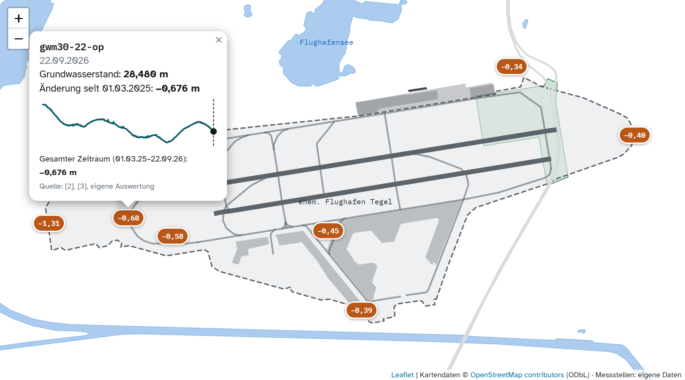

# Vom Rollfeld zur Schwammstadt

**Was Regen und Grundwasser über die Zukunft von Berlin-Tegel erzählen**

Studentisches Projekt im Kurs *Big Data* an der HTW Berlin (2026). Wir haben untersucht, ob und wie das Grundwasser auf dem ehemaligen Flughafengelände Berlin-Tegel auf Niederschlag reagiert. Die Ergebnisse haben wir als Data Story für ein breites Publikum (ab ca. 12 Jahren) aufbereitet.

**Ergebnis ansehen:** **[Website öffnen](https://possidesiree.github.io/tegel-grundwasser/)** – die Data Story läuft direkt über GitHub Pages im Browser, ohne Installation (siehe [Website veröffentlichen](#website-veröffentlichen)). Lokal: [`docs/tegel-datastory-einzeldatei.html`](docs/tegel-datastory-einzeldatei.html) im Browser öffnen.


---

## Inhalt

1. [Fragestellung](#fragestellung)
2. [Projektverlauf](#projektverlauf)
3. [Ergebnisse](#ergebnisse)
4. [Repository-Struktur](#repository-struktur)
5. [Daten](#daten)
6. [Methodik](#methodik)
7. [Datenqualität](#datenqualität)
8. [Wie die Website gebaut ist](#wie-die-website-gebaut-ist)
9. [Selbst ausführen](#selbst-ausführen)
10. [Weiterarbeiten – Hinweise für Projektpartner](#weiterarbeiten--hinweise-für-projektpartner)
11. [Grenzen der Auswertung](#grenzen-der-auswertung)
12. [Glossar](#glossar)
13. [Entstehung und KI-Einsatz](#entstehung-und-ki-einsatz)
14. [Lizenzen und Quellen](#lizenzen-und-quellen)
15. [Team und Kontakt](#team-und-kontakt)

---

## Fragestellung

> Reagiert das Grundwasser in Tegel auf Regen – und was bedeutet das für die geplante Schwammstadt?

Auf dem 500 ha großen ehemaligen Flughafengelände entstehen die Urban Tech Republic, das Schumacher Quartier und ein Landschaftsraum. Das Schumacher Quartier wird nach dem **Schwammstadt-Prinzip** geplant: Regenwasser soll gespeichert, genutzt, verdunstet und versickert werden, statt schnell abzufließen. Unsere Messdaten aus 2025/2026 beschreiben den Zustand **zu Beginn** dieser Umgestaltung und können als Ausgangslage für spätere Vergleiche dienen.

## Projektverlauf

Vom ersten Thema bis zur fertigen Website. Die letzte Spalte zeigt, wo der Schritt in der Abschlusspräsentation ([`/Praesentation_Tegel_Schwammstadt.pdf`](/Praesentation_Tegel_Schwammstadt.pdf)) vorkommt.

| Schritt | Was passiert ist | Folie |
|---|---|---|
| 1. Themenfindung | Wir hatten zunächst vier andere Themen. Sie haben nicht zu passenden Daten oder zu einer klaren Frage geführt und wurden verworfen. Die Recherche zu Tegel führte uns zum Schwammstadt-Projekt. Durch die Summer School kannten wir den FUTR HUB, der Grundwasserdaten von Messstellen auf dem Gelände bereitstellt. | 2 |
| 2. Fragestellung | „Reagiert das Grundwasser in Tegel auf Regen – und was bedeutet das für die geplante Schwammstadt?“ Warum Tegel? 500 ha Flughafenareal, im Schumacher Quartier mehr als 5.000 geplante Wohnungen für mehr als 10.000 Menschen, geplant nach dem Schwammstadt-Prinzip. | 2, 3 |
| 3. Daten beschaffen | Grundwasserdaten vom FUTR HUB. Für den Regen war die DWD-Station Tegel vorgesehen; ihre Daten liegen nur bis 2021 vor. Ersatz: das DWD-Niederschlagsraster HYRAS-DE-PR. | 4 |
| 4. Analyse | Auswertung in Power BI durch das Team: Niederschlagssummen, Veränderung je Messstelle, Median, zeitversetzte Korrelation (siehe [Methodik](#methodik)). | 4 |
| 5. Story schreiben | Fragestellung, Aufbau, Kernaussagen, Zahlen und Ausblick hat das Team selbst geschrieben. Zielgruppe: ab etwa 12 Jahren, auch am Smartphone gut lesbar. | 5 |
| 6. Website umsetzen | Umsetzung als interaktive Website mit KI-Unterstützung (siehe [Entstehung und KI-Einsatz](#entstehung-und-ki-einsatz)); die Power-BI-Logik wurde als Python-Skript nachgebaut. | 5 |
| 7. Ausblick | Messungen über mehrere Jahre weiterführen und weitere Einflussgrößen einbeziehen (siehe [Weiterarbeiten](#weiterarbeiten--hinweise-für-projektpartner)). | 6 |

## Ergebnisse

Analysezeitraum: **01.03.2025 – 22.09.2026**, 8 Grundwassermessstellen, täglicher Niederschlag.

| Befund | Wert | Art |
|---|---|---|
| Niederschlag März + April 2025 | 17,8 mm | Berechnung |
| Niederschlag Juli 2025 | 118,0 mm | Berechnung |
| Stärkster Regentag (19.04.2026) | 40,7 mm | Messwert |
| Grundwasser trockenes Frühjahr (01.03.–30.04.2025), Median | −0,183 m | Statistik |
| Grundwasser nach nassem Juli (10.07.–20.08.2025), Median | +0,0865 m | Statistik |
| Grundwasser nach 19.04.2026 (19.04.–19.06.2026), Median | +0,0705 m | Statistik |
| Grundwasser gesamt (01.03.2025–22.09.2026), Median | −0,425 m | Statistik |
| Schwankungsbreite Messstelle `gwm32-22-op` | 2,13 m | Berechnung |
| Stärkster Zusammenhang Regen → Grundwasser | nach 9–11 Tagen, r ≈ 0,43–0,63 | Statistik |
| Höchster Grundwasserstand aller 8 Messstellen (22.09.2026) | `gwm21-23-op`, 31,726 m | Messwert |

**Kurz gesagt:**

1. Trockenphasen sind im Grundwasser sichtbar: Im Frühjahr 2025 sinken alle 8 Messstellen.
2. Nach starken Regenphasen steigen viele Messstellen wieder – **zeitversetzt** um etwa ein bis zwei Wochen.
3. Die Reaktion ist von Messstelle zu Messstelle sehr unterschiedlich.
4. Die Messstellen liegen auf unterschiedlichem Niveau: Den höchsten Grundwasserstand hat fast immer `gwm21-23-op` am Ostrand des Geländes (an 547 von 561 Tagen mit Messwerten; 31,726 m am 22.09.2026, höchster Wert im Zeitraum 32,157 m). Die Stände nehmen grob von Ost nach West ab, bis auf 27,0 m an `gwm32-22-op`. Die Seite zeigt vor allem die *Veränderung*, nicht den absoluten Stand.
5. Am Ende des Zeitraums liegen alle 8 Messstellen niedriger als zu Beginn. Regen allein erklärt das nicht; auch Verdunstung, Entnahmen, Bebauung und Versiegelung beeinflussen das Grundwasser.

> Korrelation ist keine Kausalität. Die Auswertung zeigt einen statistischen Zusammenhang, keinen Beweis für Ursache und Wirkung.

### Produkt: Scrollytelling-Website

| Interaktive Karte | Scroll-Diagramm |
|---|---|
|  |  |

- 11 Kapitel: erst die Geschichte des Ortes, dann die Daten
- Interaktive Karte (Leaflet + OpenStreetMap-Daten) mit Zeitregler und Verlauf je Messstelle
- Scroll-Diagramm: Trockenphase → Juli-Regen → Grundwasseranstieg
- Bei jeder wichtigen Zahl ein ⓘ „Woher kommt diese Zahl?“ mit Berechnung und Quelle; nummerierte Fußnoten und Quellenverzeichnis
- Für Smartphone und Desktop optimiert

### Kapitelübersicht

| # | Kapitel | Inhalt | Grafik / Interaktion |
|---|---|---|---|
| 1 | Asphalt | Warum Wasser auf einem ehemaligen Flughafen wichtig ist | Foto der Landebahn |
| 2 | Früher und heute | Dieselbe Fläche, eine neue Aufgabe | Vorher/Nachher-Regler (2015 / 2022) |
| 3 | Die Idee | Kann eine Stadt wie ein Schwamm funktionieren? | Ablaufgrafik „Versiegelte Fläche“ vs. „Schwammstadt“ |
| 4 | Das neue Tegel | Warum diese Idee für Tegel interessant ist | Luftbild, Kennzahlen zum Gelände |
| 5 | Unter der Erde | Wo wird gemessen? Was ist Grundwasser? | Interaktive Karte mit Zeitregler, Bodenquerschnitt |
| 6 | Frühjahr 2025 | Es regnet kaum; Grundwasser verhält sich nicht überall gleich | Eimer-Grafik, Balkendiagramm je Messstelle |
| 7 | Sommer 2025 | Plötzlich wird es nass | Tagesdiagramm Juli 2025, Regentonnen-Vergleich |
| 8 | Die Reaktion | Der Regen kommt zuerst, das Grundwasser folgt später; warum es eine Verzögerung gibt | Scroll-Diagramm, Korrelationskurve nach Tagen |
| 9 | Frühjahr 2026 | 19. April 2026: ein außergewöhnlicher Regentag; das Grundwasser reagiert wieder | Vergleich April/März, Verlauf der Messstelle `gwm32-22-op` |
| 10 | Die Bilanz | Regen hilft, setzt die Uhr aber nicht einfach zurück | Balkendiagramm Gesamtveränderung |
| 11 | Zurück nach Tegel | Was bedeutet das für das neue Tegel? Schwammstadt-Projekte, offene Frage | Zeitleiste, Projektübersicht |

Danach folgen **Methodik** und **Quellenverzeichnis** (jede Zahl ist verlinkt).

## Repository-Struktur

```
├── data/
│   ├── raw/          Rohdaten, unverändert (CSV)
│   ├── processed/    aufbereitete Daten (CSV, GeoJSON, JSON) – vom Skript erzeugt
│   ├── osm/          OpenStreetMap-Auszug Flughafengelände (GeoJSON)
│   └── README.md     Datenbeschreibung (Spalten, Einheiten, Lizenzen)
├── src/
│   ├── build_tegel.py      Auswertung + Export + Website-Build
│   └── web/                Vorlage der Website (HTML/CSS/JS) und Leaflet-C
├── praesentation/
│   └── Praesentation_Tegel_Schwammstadt.pptx   Abschlusspräsentation
├── power-bi/
│   └── Grundwasser.pbix    Power-BI-Auswertung des Teams (Diagramme, Berechnungen)
├── nachweise/
│   └── Eigenstaendigkeitserklaerung_KI-Verzeichnis.pdf   Erklärung + KI-Verzeichnis
├── docs/             fertige Website (GitHub Pages)
│   ├── index.html                     Website, Fotos aus docs/img/
│   ├── tegel-datastory-einzeldatei.html  eine Datei, Fotos online
│   ├── img/                           Fotos (Wikimedia Commons)
│   └── screenshots/                   Screenshots für diese README
├── requirements.txt
└── LICENSE
```

## Daten

| Datei | Inhalt | Quelle |
|---|---|---|
| `data/raw/Grundwasser je messstation im zeitverlauf.csv` | Tägliche Grundwasserstände (m) von 10 Messstellen | FUTR HUB, Urban Tech Republic |
| `data/raw/Karte mit Grundwasserpegel.csv` | Koordinaten (WGS 84) und Pegel von 8 Messstellen | FUTR HUB, Urban Tech Republic |
| `data/raw/Niederschlag_Flughafen_Tegel_2025_2026_v6-1_taeglich.csv` | Täglicher Niederschlag (mm), Rasterpunkt Tegel | DWD, HYRAS-DE-PR, Version v6-1 |
| `data/osm/tegel_osm.geojson` | Flughafenumriss, Bahnen, Terminal, Gewässer, Autobahnen | © OpenStreetMap contributors (ODbL) |

Alle aufbereiteten Dateien in `data/processed/` sind UTF-8, Komma-getrennt, Dezimalpunkt, Datum im Format ISO 8601 (`YYYY-MM-DD`), Koordinaten in WGS 84 (EPSG:4326). Spaltenbeschreibung: [`data/README.md`](data/README.md).

**Warum HYRAS statt Wetterstation?** Die Daten der DWD-Station Berlin-Tegel lagen uns nur bis 2021 vor und decken den Analysezeitraum nicht ab. Wir haben deshalb den HYRAS-Rasterdatensatz (1 × 1 km, täglich) verwendet und den Rasterpunkt über Tegel ausgelesen. Die ursprüngliche Rohdatei enthielt für 01.01.2025–03.01.2026 zwei Versionen (v6.0 und v6-1, an 31 Tagen abweichend); verwendet wird konsequent **v6-1**.

## Methodik

- **Messstellen:** die 8 Messstellen aus `Karte mit Grundwasserpegel.csv`. Die Zeitreihe enthält zwei weitere Reihen (`gwm1-16`, `gwm5-95`) ohne Koordinaten; sie wurden nicht verwendet.
- **Änderung je Zeitraum:** je Messstelle letzter minus erster verfügbarer Tageswert, in Metern. Zusammengefasst wird mit dem **Median** der 8 Messstellen, damit die stark schwankende Messstelle `gwm32-22-op` das Ergebnis nicht dominiert.
- **Zeitversetzte Korrelation:** Pearson-Korrelation zwischen der 30-Tage-Regensumme und der 30-Tage-Grundwasseränderung. Die Regensumme wird um 0–42 Tage verschoben (`r30.shift(lag)`). Drei Varianten: Mittelwert der Messstellen, Median der Messstellen, je Messstelle einzeln (danach Median). Messlücken bis 5 Tage werden linear interpoliert. Ergebnis: `data/processed/korrelation_regen_grundwasser_verschiebung.csv`.
- **Qualitätsprüfung:** `build_tegel.py` vergleicht 13 im Text genannte Zahlen mit den neu berechneten Werten und meldet Abweichungen.

## Datenqualität

Was wir an den Daten geprüft haben, was auffiel und wie wir damit umgegangen sind.

| Thema | Befund | Umgang |
|---|---|---|
| Anzahl Grundwasser-Reihen | Die Datei enthält 10 Reihen, aber nur 8 Messstellen haben Koordinaten (`gwm1-16` und `gwm5-95` nicht). | Nur die 8 Messstellen mit Koordinaten werden verwendet. |
| Abdeckung | Je Messstelle liegen für 522–553 der 571 Tage Werte vor (91–97 %). An 561 Tagen gibt es mindestens einen Wert, an 488 Tagen alle acht. Die längste Lücke einer Messstelle beträgt 3 Tage. | Veränderungen je Zeitraum nutzen den ersten und letzten **verfügbaren** Messwert. Für Median-Verlauf und Korrelation werden Lücken bis 5 Tage linear interpoliert. |
| Stark schwankende Messstelle | `gwm32-22-op` schwankt um 2,13 m, die anderen um 0,36–0,95 m. Der Grund lässt sich aus den Daten nicht erklären. | Die Messstelle wird **nicht entfernt**. Zusammengefasst wird mit dem Median, damit sie das Ergebnis nicht dominiert. |
| Niederschlag, Vollständigkeit | 630 Tage in der Datei (01.01.2025–22.09.2026), 571 davon im Analysezeitraum, **keine fehlenden Werte**. An 214 Tagen fiel Niederschlag, die Summe beträgt 675,9 mm. | Keine Ergänzung nötig. |
| Niederschlag, Prüfstatus | Der DWD kennzeichnet alle Tageswerte mit `partly_checked` (teilweise geprüft). Pro Tag gingen etwa 1.970–2.570 Stationen in die Berechnung des Rasters ein. | Wir verwenden die Werte unverändert und weisen darauf hin, dass der Rasterpunkt keine Messung direkt auf dem Gelände ist. |
| HYRAS-Versionen | Die ursprüngliche Rohdatei enthielt für 01.01.2025–03.01.2026 zwei Versionen (v6.0 und v6-1), die an 31 Tagen abwichen. | Konsequent **v6-1**; kein Tag wird doppelt gezählt. |
| Zahlen im Text | Die Seite nennt viele Kennzahlen, die sich beim Ändern der Daten verschieben können. | `build_tegel.py` rechnet 13 Zahlen neu und meldet jede Abweichung . |
| Rundung | Die Seite zeigt gerundete Werte (z. B. −0,18 m), die Dokumentation die genaueren (−0,183 m). | Rundung kaufmännisch; die genauen Werte stehen in den Popovers „Woher kommt diese Zahl?“. |

## Wie die Website gebaut ist

Die Website ist **reines HTML, CSS und JavaScript – ohne Framework und ohne Build-Werkzeug im Browser**. Damit sie sich bei neuen Daten nicht von Hand ändern muss, gibt es eine Vorlage und ein Python-Skript, das sie mit den berechneten Daten füllt:

```
data/raw/*.csv ──► src/build_tegel.py (pandas) ──► data/processed/*  (CSV, GeoJSON, JSON)
                         │
src/web/template.html ───┤  Platzhalter ersetzen:
src/web/leaflet.css  ────┤  __DATA__  __GEO__  __LEAFLET_CSS__  __RAINFILE__
data/osm/*.geojson   ────┘
                         ▼
          docs/index.html                      (Fotos aus docs/img/)
          docs/tegel-datastory-einzeldatei.html (eine Datei, Fotos online)
```

**Wichtig:** Texte, Layout und Skripte der Website werden **nur in `src/web/template.html`** geändert. `docs/index.html` wird bei jedem Lauf von `build_tegel.py` überschrieben.

### Bausteine der Seite

| Baustein | Umsetzung |
|---|---|
| Daten | Als JavaScript-Konstanten direkt in die Seite eingebettet: `D` (Niederschlag und Grundwasser je Tag und Messstelle), `GEO` (OpenStreetMap-Umrisse), `SOURCES` (16 Quellen), `IMAGES` (6 Fotos mit Lizenz), `INFO` (Erklärtexte der ⓘ-Popovers). Es gibt keinen Server und keine Datenbank. |
| Diagramme | Eigener SVG-Code (keine Chart-Bibliothek), live aus `D` gezeichnet. Farben kommen aus CSS-Variablen. |
| Karte | Leaflet 1.9.4 (JavaScript von `cdnjs.cloudflare.com`, CSS in die Seite eingebettet). **Kein Kachel-Hintergrund:** Flughafenumriss, Bahnen, Terminal, Gewässer und Straßen werden aus `GEO` als Vektorflächen gezeichnet; die acht Messstellen sind Marker mit Zeitregler und Verlaufskurve. |
| Scroll-Diagramm | Karten mit Text (`.stepcard`) schalten per Scrollen oder Tastatur den hervorgehobenen Zeitraum um (`STEPS`, `drawScrolly()`): Trockenphase → Juli-Regen → Grundwasseranstieg. |
| „Woher kommt diese Zahl?“ | Jede Kennzahl ist ein ⓘ-Button (`data-info`) und öffnet ein Popover aus `INFO` mit Wert, Berechnung, Art (● Messwert, ∑ Berechnung, ≈ Statistik) und Quelle. |
| Quellen | `[n]`-Verweise (`data-ref`) öffnen die Quellenkarte; das Quellenverzeichnis am Seitenende wird beim Laden aus `SOURCES` und `IMAGES` erzeugt. |
| Vorher/Nachher-Regler | Zwei Fotos übereinander; ein Schieberegler setzt die CSS-Variable `--pos`. |
| Eigene Grafiken | Symbole und Abläufe („Versiegelte Fläche“ vs. „Schwammstadt“, Bodenquerschnitt, Regentonnen) sind selbst gezeichnetes SVG im Code. Es gibt keine KI-generierten Bilder. |

### Gestaltung und Barrierefreiheit

- Farben als CSS-Variablen; je Kapitel eine Stimmung (Asphalt, Wasser, Trockenheit, Grün). **Hell- und Dunkelmodus** folgen automatisch der Systemeinstellung.
- Schriften: Archivo (Überschriften), Atkinson Hyperlegible (Text), IBM Plex Mono (Beschriftungen), geladen über Google Fonts.
- Diagramme, Karte und Vergleichsregler haben Textbeschreibungen (`aria-label`); Messstellen-Marker, Schritt-Karten und Popovers sind per Tastatur bedienbar (`Esc` schließt Popovers); es gibt einen „Direkt zu den Daten“-Link und sichtbare Fokusrahmen.
- Bei der Systemeinstellung „Bewegung reduzieren“ werden Animationen abgeschaltet.
- Für Smartphone und Desktop ausgelegt.

### Technische Einschränkungen

- Ohne Internet fehlen Schriften und die Kartenbibliothek (Leaflet); die Karte bleibt dann leer.
- Die Kartengeometrie ist ein Schnappschuss (Overpass-Abfrage, Stand 01.06.2026) und wird nicht automatisch aktualisiert.
- Zahlen in Fließtexten sind fest geschrieben; ändern sich die Daten, meldet das Skript Abweichungen, die Texte müssen aber von Hand angepasst werden.
- Es gibt keine automatisierten Tests; Änderungen vor dem Veröffentlichen lokal im Browser prüfen.
  
## Selbst ausführen

Voraussetzung: Python ≥ 3.10.

```bash
pip install -r requirements.txt
python src/build_tegel.py
```

Das Skript liest `data/raw/`, prüft die Kennzahlen, schreibt `data/processed/` und erzeugt `docs/index.html`. Die Website läuft ohne Server: `docs/index.html` im Browser öffnen (Internet nötig für Schriften und die Kartenbibliothek Leaflet).

### Website veröffentlichen

Auf GitHub: *Settings → Pages → Branch `main`, Ordner `/docs`*. Danach ist die Website unter [https://possidesiree.github.io/tegel-grundwasser/](https://possidesiree.github.io/tegel-grundwasser/) erreichbar.

## Weiterarbeiten – Hinweise für Projektpartner

Für die **Tegeler Stadtheide** und das **CityLAB Berlin**:

- **Neue Messdaten einspielen:** neue CSV-Dateien mit gleichem Aufbau in `data/raw/` ablegen, Zeitraum in `src/build_tegel.py` (`START`, `END`) anpassen, Skript ausführen. Das Skript meldet, welche Zahlen im Text sich geändert haben.
- **Daten direkt nutzen:** `data/processed/` enthält alles in offenen Standardformaten – für Excel/LibreOffice (CSV), QGIS/uMap/Kepler.gl (GeoJSON) oder Python/R.
- **Karte weiterverwenden:** `data/processed/messstellen.geojson` lässt sich direkt in QGIS oder [uMap](https://umap.openstreetmap.de/) laden.
- **Website anpassen:** Texte und Diagramme stehen in `src/web/template.html` (HTML, CSS, JavaScript ohne Build-Werkzeuge). Nach Änderungen `python src/build_tegel.py` ausführen.
- **Ideen für die Fortsetzung:**
  - Messungen über mehrere Jahre weiterführen, um Effekte der Bebauung und der Schwammstadt-Maßnahmen zu erkennen.
  - Weitere Einflussgrößen einbeziehen: Bodenbeschaffenheit, Verdunstung, Temperatur, Versickerung, Grundwasserentnahmen.
  - Vergleichsgebiet ohne Umbau heranziehen.
  - Anbindung an eine offene Datenplattform (z. B. per API), damit die Seite automatisch aktualisiert wird.

**Zentrale Frage für die Zukunft:** Wie kann Regenwasser in Tegel so genutzt und gespeichert werden, dass es sowohl bei Starkregen als auch in trockenen Zeiten zu einem möglichst ausgeglichenen Wasserhaushalt beiträgt?

## Grenzen der Auswertung

- Rund 1,5 Jahre Daten – für langfristige Trends zu kurz.
- Niederschlag aus einem Rasterdatensatz, nicht direkt am Gelände gemessen.
- Die zeitversetzte Korrelation nutzt überlappende 30-Tage-Fenster; es wurde kein Signifikanztest durchgeführt.
- Andere Einflüsse (Verdunstung, Entnahmen, Baumaßnahmen) sind nicht herausgerechnet.
- Warum einzelne Messstellen (z. B. `gwm32-22-op`) besonders stark schwanken, lässt sich aus den Daten allein nicht erklären.

## Glossar

| Begriff | Bedeutung |
|---|---|
| Grundwasserstand (Pegel) | Höhe des Grundwasserspiegels an einer Messstelle, hier in Metern angegeben. |
| Messstelle (`gwm…`) | Stelle auf dem Gelände, an der der Grundwasserstand täglich erfasst wird. Die Kennungen stammen vom Datengeber. |
| Niederschlagshöhe | Regenmenge in Millimetern. 1 mm entspricht 1 Liter pro Quadratmeter ([DWD-Glossar](https://www.dwd.de/DE/service/lexikon/begriffe/N/Niederschlagshoehe.html)). |
| HYRAS / Rasterpunkt | Täglicher Niederschlagsdatensatz des DWD auf einem Gitter von 1 × 1 km. Wir nutzen den Gitterpunkt über Tegel. |
| Veränderung | Letzter minus erster verfügbarer Messwert in einem Zeitraum. Negativ heißt: Das Grundwasser ist gesunken. |
| Median | Mittlerer Wert, wenn man alle Werte der Größe nach ordnet. Anders als der Mittelwert wird er von einzelnen Ausreißern kaum beeinflusst. |
| Korrelation (Pearson-r) | Maß zwischen −1 und +1 dafür, wie gleichläufig sich zwei Reihen verändern. Nahe 0 bedeutet kaum Zusammenhang. Sie sagt **nichts über Ursache und Wirkung**. |
| Zeitverschiebung (Lag) | Um wie viele Tage die Regensumme gegenüber der Grundwasseränderung verschoben wird, um zu sehen, **wann** das Grundwasser auf Regen reagiert. |
| Versiegelung | Boden, der mit Asphalt, Beton oder Gebäuden bedeckt ist. Regen kann dort nicht versickern. |
| Schwammstadt | Planungsprinzip: Regenwasser soll dort bleiben, wo es fällt: speichern, nutzen, verdunsten, versickern, statt schnell in die Kanalisation abzufließen. |
| Scrollytelling | Erzählform, bei der sich Grafiken und Texte beim Herunterscrollen Schritt für Schritt verändern. |

## Entstehung und KI-Einsatz

Das Projekt ist in vier Schritten entstanden (ausführlich mit Prompts im [KI-Verzeichnis](nachweise/Eigenstaendigkeitserklaerung_KI-Verzeichnis.pdf)):

1. **Datenanalyse durch das Team, ohne KI.** Grundwasser- und Niederschlagsdaten wurden vom Team beschafft, aufbereitet und in Power BI ausgewertet ([`power-bi/Grundwasser.pbix`](power-bi/Grundwasser.pbix), mit Power BI Desktop zu öffnen). Power BI eignete sich für das Nachvollziehen der Auswertung, aber nur eingeschränkt für eine Data Story, die ein breites Publikum Schritt für Schritt führt.
2. **Data Story durch das Team, ohne KI.** Fragestellung, Aufbau, Kernaussagen, Zahlen und Ausblick hat das Team selbst geschrieben.
3. **Umsetzung als Website mit KI-Unterstützung (Claude).** Claude wurde eingesetzt, um die Story als HTML-Website mit Diagrammen und Scrollytelling umzusetzen, Quellen zu recherchieren und einzubauen, die Power-BI-Logik als Python-Skript (`src/build_tegel.py`) nachzubauen und die Fakten der Story gegen die Daten zu prüfen. Auch Teile dieser Dokumentation (README, technische Beschreibung) sind mit Claude entstanden und vom Team geprüft.
4. **Gestaltungsideen mit Figma Make.** Als Orientierung für die Optik (Bildsprache, Aufbau von Titelbereich und Kennzahlen-Karten) wurde zusätzlich das KI-Werkzeug Figma Make genutzt. Code daraus wurde nicht übernommen; die Website selbst ist in `src/web/template.html` umgesetzt.

Alle Zahlen der Website lassen sich über `python src/build_tegel.py` aus den Rohdaten neu berechnen und mit den Texten abgleichen.

## Lizenzen und Quellen

| Bestandteil | Lizenz |
|---|---|
| Code (`src/`) | [MIT](LICENSE) |
| Texte, aufbereitete Daten (`data/processed/`) | [CC BY 4.0](https://creativecommons.org/licenses/by/4.0/deed.de) |
| Niederschlag (HYRAS) | DWD, frei nutzbar mit Quellenangabe ([GeoNutzV](https://www.gesetze-im-internet.de/geonutzv/)) |
| Grundwasserdaten | FUTR HUB, Urban Tech Republic – Nutzungsbedingungen beim Datengeber |
| Kartendaten | © [OpenStreetMap contributors](https://www.openstreetmap.org/copyright), ODbL |
| Fotos (`docs/img/`) | Wikimedia Commons, CC BY-SA 4.0 bzw. CC BY 2.0 – Urheber siehe Bildnachweis auf der Website |
| Leaflet | BSD-2-Clause |

**Wichtige Quellen** (abgerufen 23.09.2026):

- Deutscher Wetterdienst: [HYRAS-DE-PR](https://www.dwd.de/DE/leistungen/hyras_de_pr/hyras_de_pr.html)
- FUTR HUB – Innovating Urban Data: [futr-hub.urbantechrepublic.de](https://futr-hub.urbantechrepublic.de/)
- Berlin TXL Management GmbH: [Über uns](https://tegelprojekt.de/ueber-uns/)
- Senatsverwaltung für Stadtentwicklung, Bauen und Wohnen: [Startschuss für Wohnungsbau im Schumacher Quartier](https://www.berlin.de/sen/stadt/presse/pressemeldungen/pressemitteilung.1526943.php), 31.01.2025
- Schumacher Quartier: [Wassernutzung](https://schumacher-quartier.de/wassernutzung/)
- Das vollständige Quellenverzeichnis steht am Ende der Website.

## Team und Kontakt

| | |
|---|---|
| Projektteam | [Thi Huyen Phan(ThiHuyen.Phan@student.htw-berlin.de); Ahmad Alkridi(Ahmad.Alkridi@student.htw-berlin.de); Desiree Possi(Desiree.Possi@Student.HTW-Berlin.de ), Enes Kulanoglu(Enes.Kulanoglu@student.htw-berlin.de)] |
| Kurs | Big Data Analytics,Team: Data in Motion, HTW Berlin in Cooperation mit CityLAB Berlin, 2026 |

Fragen, Fehler oder Verbesserungsvorschläge gern als [Issue](../../issues) in diesem Repository :)
